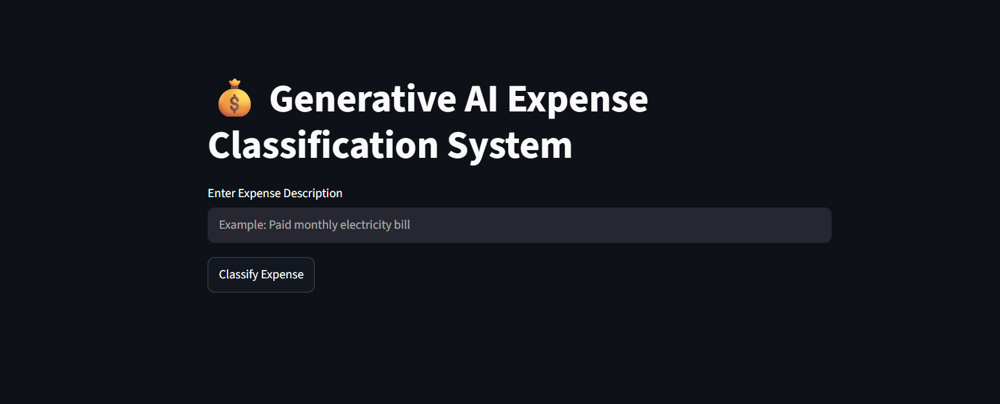

# 💰 Generative AI Expense Classification System



An AI-powered expense classification system built using Google Gemini API and Streamlit.

The application analyzes expense descriptions provided by users and automatically classifies them into appropriate categories such as Food, Travel, Utilities, Healthcare, Entertainment, Shopping, and more.

---

## 🚀 Features

- 💰 Expense Classification
- 🤖 Google Gemini AI Integration
- 📝 Natural Language Expense Analysis
- ⚡ Real-Time Predictions
- 🎯 Structured Category Output
- 🌐 Streamlit Web Interface

---

## 🛠️ Tech Stack

- Python
- Streamlit
- Google Gemini API
- Prompt Engineering

---

## 📂 Project Structure

```text
genai-expense-classification-system/
│
├── Banner_.png
├── app.py
├── memory.py
├── model.py
├── parser.py
├── prompt.py
└── requirements.txt
```

---

## ⚙️ Installation

Clone the repository:

```bash
git clone https://github.com/prasadkandreddi/genai-expense-classification-system.git
```

Move into project folder:

```bash
cd genai-expense-classification-system
```

Install dependencies:

```bash
pip install -r requirements.txt
```

Create a `.env` file:

```env
GEMINI_API_KEY=YOUR_API_KEY
```

Run the application:

```bash
streamlit run app.py
```

---

## 💡 Example Input

```text
Paid monthly electricity bill
```

## 📤 Example Output

```text
Category: Utilities
```

---

## 🎓 Learning Outcomes

- Gemini API Integration
- Prompt Engineering
- Generative AI Applications
- Expense Categorization
- Streamlit Development
- AI-Powered Automation

---

## 👨‍💻 Author

Prasad Kandreddi

GitHub:
https://github.com/prasadkandreddi

LinkedIn:
https://www.linkedin.com/in/kandreddi-prasad-7117952a6

---

## ⭐ Support

If you found this project useful, consider giving it a star on GitHub.
